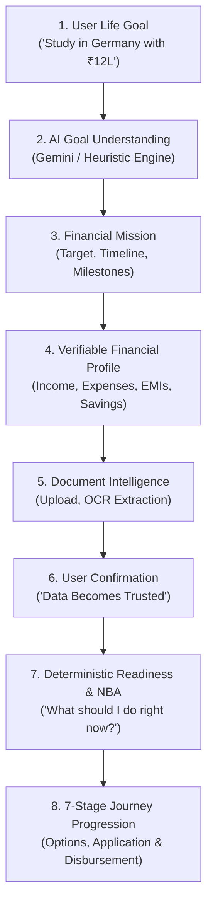
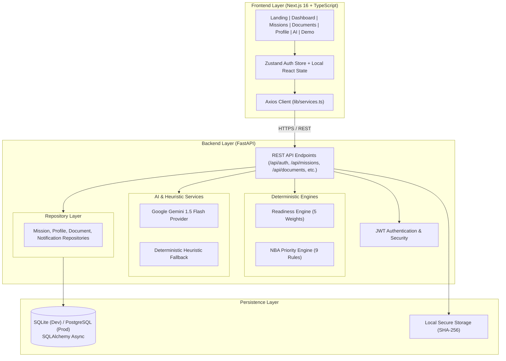

# FinPath AI

> **Turn your financial goal into a clear journey.**

[](https://nextjs.org/)
[](https://fastapi.tiangolo.com/)
[](https://www.python.org/)
[](https://www.typescriptlang.org/)
[](https://www.sqlalchemy.org/)
[](https://ai.google.dev/)
[](#testing)

FinPath AI is a goal-first financial journey platform. Instead of beginning with an overwhelming catalog of financial products, FinPath starts with what you are actually trying to achieve — converting unstructured life goals into structured Financial Missions, verified readiness metrics, and clear next steps.

---

## Product Overview

Traditional financial platforms are product-centric. When you want to pursue higher education, buy a first home, or start a business, banks present you with a wall of credit cards, personal loans, fixed deposits, and mutual funds. You are expected to decipher loan tenures, calculate your own debt-to-income ratio, and figure out what documentation you need.

**FinPath AI flips this model completely:**

```
Traditional Platforms:  [Financial Product]  ──────►  [Customer]
FinPath AI:             [User Goal]  ──►  [Understanding]  ──►  [Journey]  ──►  [Product]
```

FinPath AI asks: *"What is your goal?"*  
You state: *"I want to study in Germany next year and I need around ₹12 lakh."*  
FinPath AI parses your intent, builds a structured **Financial Mission**, collects and extracts data from required documents, empowers you to confirm extracted values into **trusted data**, evaluates your readiness score deterministically, and continuously tells you your **Next Best Action**.

---

## Why FinPath AI?

| Problem in Traditional Finance | FinPath AI Solution |
| :--- | :--- |
| **Product Catalogs First**: Platforms push high-margin loans before understanding context. | **Goal-First Understanding**: Starts with your real-life objective in natural language. |
| **Document Anxiety**: Users are unsure what papers to gather, what fields matter, and why. | **Intelligent OCR & Checklist**: Category-specific document requirements with automated OCR extraction. |
| **Hallucinatory AI Risk**: Chatbots fabricate numbers or give legally questionable financial advice. | **Deterministic Trust**: Readiness scores and Next Best Actions are computed by 100% deterministic rules — never guessed by an LLM. |
| **"Where do I stand?"**: Borrowers have no visibility into readiness until rejection. | **Real-Time Readiness Gauge**: 5-factor transparent score showing exact factors influencing approval. |
| **Cognitive Overload**: Too many forms, tabs, and simultaneous tasks. | **Next Best Action (NBA)**: A single, prioritized call-to-action on every screen. |

---

## Core Flow



---

## Key Features

- 🎯 **Goal-First Journey**: Life ambitions are converted into structured missions with measurable targets, currency tracking, and deadlines.
- 🧠 **AI Goal Understanding**: Multi-parameter natural-language extraction (category, amount, timeline, destination) powered by Gemini with zero-dependency heuristic fallbacks.
- 📄 **Intelligent Document Processing**: Asynchronous OCR pipeline handling passports, bank statements, offer letters, and salary slips with SHA-256 deduplication.
- 🔐 **Human-in-the-Loop Verification**: AI-extracted fields remain in staging until the user inspects and confirms them, locking them as trusted system data.
- 📊 **Verifiable Financial Profile**: Structured financial health tracking covering monthly income, fixed expenses, liquid savings, existing EMIs, and debt-to-income (DTI) metrics.
- 🧭 **7-Stage Mission Roadmap**: Clear visual progression tracking stages from Goal Definition to Completion and Milestone Disbursement.
- ⚡ **Next Best Action (NBA) Engine**: A 9-rule deterministic priority queue evaluating database state to surface the single most impactful next step.
- 💬 **Context-Aware AI Assistant**: Real-time financial copilot aware of active mission parameters, unreviewed documents, and profile gaps.
- 📈 **Progress & Readiness Dashboard**: Real-time 0–100% readiness score with component breakdown and audit-logged milestones.
- 🔔 **Integrated Notification System**: Real-time alerts for document extractions, completeness milestones, and approaching deadlines.
- 🚀 **Zero-Login Interactive Demo**: Instant showcase mode at `/demo` with pre-loaded scenarios for evaluators and juries.

---

## System Architecture



---

## Tech Stack

### Frontend
- **Framework**: Next.js 16 (App Router with Turbopack)
- **Language**: TypeScript 5
- **Styling**: FinPath Design System (Vanilla CSS tokens, responsive layouts, high-contrast fintech aesthetic)
- **State Management**: Zustand (Auth session) + React Hooks
- **Icons & Typography**: Inter font family, native semantic UI elements

### Backend
- **Framework**: FastAPI (Python 3.11+)
- **ORM & Migrations**: SQLAlchemy 2.0 (AsyncIO)
- **Validation**: Pydantic v2
- **Authentication**: JWT (HS256) with bcrypt password hashing
- **File Processing**: Python `hashlib` (SHA-256 deduplication), `mimetypes`

### Artificial Intelligence & Rules
- **Primary AI**: Google Gemini 1.5 Flash
- **Fallback Engine**: Pure Python regex and deterministic keyword heuristic extractors (operates with 0 external dependencies when API keys are absent)
- **Decision Engine**: Deterministic rule engines for Readiness and Next Best Action

### Database & Storage
- **Development**: SQLite with `aiosqlite`
- **Production Path**: PostgreSQL with `asyncpg`
- **File Store**: Hash-indexed local filesystem storage with MIME validation

### Quality Assurance
- **Backend Tests**: pytest, pytest-asyncio (18 test suites passing)
- **Frontend Build**: Next.js static and dynamic page compiler (14 routes passing)

---

## Project Structure

```
paytm/
├── backend/
│   ├── app/
│   │   ├── api/                 # REST API route handlers
│   │   │   ├── ai.py            # AI parse, chat, global NBA & readiness
│   │   │   ├── auth.py          # Register, login, me
│   │   │   ├── documents.py     # Upload, classify, extract, confirm
│   │   │   ├── missions.py      # Mission CRUD, stage transitions
│   │   │   ├── notifications.py # Real-time user notifications
│   │   │   └── profile.py       # Financial profile endpoints
│   │   ├── core/                # Configuration, async DB session, JWT security
│   │   ├── models/              # SQLAlchemy domain models
│   │   ├── repositories/        # Database access repository pattern
│   │   ├── schemas/             # Pydantic request/response contracts
│   │   └── services/            # Business logic
│   │       ├── ai/              # Gemini integration & heuristic parser
│   │       ├── documents/       # OCR simulation & file storage
│   │       └── missions/        # Readiness & NBA deterministic engines
│   ├── tests/                   # Automated pytest test suites
│   ├── requirements.txt         # Backend Python dependencies
│   └── .env.example             # Backend environment template
├── frontend/
│   ├── app/                     # Next.js App Router pages
│   │   ├── page.tsx             # Landing page with interactive goal analyzer
│   │   ├── dashboard/           # Main user dashboard with NBA hero
│   │   ├── demo/                # Zero-login presentation environment
│   │   ├── missions/            # 7-Stage mission roadmap
│   │   ├── documents/           # Document center & review flow
│   │   ├── profile/             # Verifiable financial profile
│   │   ├── ai/                  # Context-aware financial assistant
│   │   ├── progress/            # Milestone timeline & readiness breakdown
│   │   ├── login/ & register/   # User authentication
│   │   └── globals.css          # FinPath Design System CSS tokens
│   ├── components/layout/       # Navigation, notifications, footer
│   ├── lib/                     # API client and service endpoints
│   └── types/                   # Shared TypeScript definitions
├── docs/                        # Complete technical documentation
│   ├── PRODUCT_DOCUMENTATION.md # Comprehensive product specification
│   ├── SYSTEM_ARCHITECTURE.md   # Technical architecture & data flows
│   ├── USER_JOURNEY.md          # 7-stage roadmap and personas
│   └── API_REFERENCE.md         # Exhaustive REST API reference
├── WALKTHROUGH.md               # 3-minute presentation script & guide
└── README.md                    # This document
```

---

## Getting Started

### Prerequisites
- **Python**: 3.11 or newer
- **Node.js**: 18.x or newer (with npm)
- **Git**

### 1. Clone the Repository
```bash
git clone https://github.com/Sushrut-Kale/paytm.git
cd paytm
```

### 2. Backend Setup
```bash
cd backend
python -m venv venv
# On Windows:
.\venv\Scripts\activate
# On Linux/macOS:
source venv/bin/activate

pip install -r requirements.txt
cp .env.example .env
```

Start the FastAPI backend server:
```bash
# Windows PowerShell
$env:DATABASE_URL="sqlite+aiosqlite:///./finpath_dev.db"
$env:SECRET_KEY="dev-secret-finpath-2026"
python -m uvicorn app.main:app --port 8000 --reload
```

* Backend API running at: `http://localhost:8000`
* Interactive OpenAPI Documentation: `http://localhost:8000/docs`
* Health Check: `http://localhost:8000/health`

### 3. Frontend Setup
In a new terminal window:
```bash
cd frontend
npm install
npm run dev
```

* Web Application running at: `http://localhost:3000`
* Interactive Demo Mode: `http://localhost:3000/demo`

---

## Environment Variables

Copy `.env.example` to `.env` in both `backend/` and root:

| Variable | Required | Default / Example | Purpose |
| :--- | :---: | :--- | :--- |
| `DATABASE_URL` | Yes | `sqlite+aiosqlite:///./finpath_dev.db` | Async database connection string |
| `SECRET_KEY` | Yes | `generate-a-secure-random-key` | JWT token cryptographic signing |
| `ALGORITHM` | No | `HS256` | JWT signature algorithm |
| `ACCESS_TOKEN_EXPIRE_MINUTES` | No | `10080` (7 days) | Session duration |
| `LLM_PROVIDER` | No | `gemini` | AI provider (`gemini`) |
| `LLM_API_KEY` | No | *(Empty)* | Gemini API key (fallback works if unset) |
| `LLM_MODEL` | No | `gemini-1.5-flash` | Gemini model name |
| `FRONTEND_URL` | No | `http://localhost:3000` | CORS allowed origin |
| `STORAGE_PATH` | No | `./storage` | Directory for uploaded documents |

> **Note**: If `LLM_API_KEY` is omitted, FinPath seamlessly activates its **Heuristic Fallback Engine**, ensuring that goal parsing, chat guidance, and document workflows remain 100% operational.

---

## Testing Status

The backend includes a comprehensive pytest suite verifying authentication, authorization, isolation, document pipelines, and profile mathematics.

```bash
cd backend
$env:DATABASE_URL="sqlite+aiosqlite:///./test_finpath.db"
python -m pytest tests/ -v
```

```
============================= test session starts =============================
tests/test_phase1.py::test_register_user PASSED                          [  5%]
tests/test_phase1.py::test_register_duplicate_email PASSED               [ 11%]
tests/test_phase1.py::test_login PASSED                                  [ 16%]
tests/test_phase1.py::test_login_wrong_password PASSED                   [ 22%]
tests/test_phase1.py::test_parse_goal_germany_study PASSED               [ 27%]
tests/test_phase1.py::test_parse_goal_missing_info PASSED                [ 33%]
tests/test_phase1.py::test_parse_goal_unauthenticated PASSED             [ 38%]
tests/test_phase1.py::test_create_mission PASSED                         [ 44%]
tests/test_phase1.py::test_mission_persists PASSED                       [ 50%]
tests/test_phase1.py::test_mission_authorization PASSED                  [ 55%]
tests/test_phase1.py::test_list_missions_isolation PASSED                [ 61%]
tests/test_phase1.py::test_upload_invalid_format PASSED                  [ 66%]
tests/test_phase1.py::test_upload_valid_document PASSED                  [ 72%]
tests/test_phase1.py::test_upload_duplicate_rejected PASSED              [ 77%]
tests/test_phase1.py::test_document_authorization PASSED                 [ 83%]
tests/test_phase1.py::test_empty_profile PASSED                          [ 88%]
tests/test_phase1.py::test_update_profile PASSED                         [ 94%]
tests/test_phase1.py::test_profile_completion_calculation PASSED         [100%]

======================= 18 passed, 0 failures in 6.34s =======================
```

Frontend production verification:
```bash
cd frontend
npm run build
# Result: 14/14 static and dynamic routes compiled successfully with 0 TypeScript errors.
```

---

## API Summary

| Method | Endpoint | Auth | Description |
| :--- | :--- | :---: | :--- |
| `POST` | `/api/auth/register` | None | Register account and receive JWT |
| `POST` | `/api/auth/login` | None | Authenticate with credentials |
| `GET` | `/api/auth/me` | Bearer | Get current user profile |
| `POST` | `/api/ai/parse-goal` | None | Extract structured parameters from goal text |
| `POST` | `/api/ai/chat` | Bearer | Context-aware journey copilot |
| `GET` | `/api/ai/nba` | Bearer | Compute current Next Best Action |
| `GET` | `/api/ai/readiness` | Bearer | Compute 5-factor readiness evaluation |
| `GET` | `/api/missions/` | Bearer | List user's financial missions |
| `POST` | `/api/missions/` | Bearer | Create a new financial mission |
| `GET` | `/api/missions/{id}` | Bearer | Retrieve mission details |
| `PATCH` | `/api/missions/{id}` | Bearer | Update mission stage, targets, status |
| `POST` | `/api/documents/upload` | Bearer | Upload document with SHA-256 deduplication |
| `GET` | `/api/documents/` | Bearer | List user's uploaded documents |
| `POST` | `/api/documents/{id}/confirm` | Bearer | Confirm OCR fields into trusted data |
| `GET` | `/api/profile/` | Bearer | Get user financial profile & completeness |
| `PATCH`| `/api/profile/` | Bearer | Update income, expenses, EMIs, savings |
| `GET` | `/api/notifications/summary` | Bearer | Unread notification count and alert feed |
| `POST` | `/api/notifications/mark-all-read` | Bearer | Mark all notifications as read |

---

## Design System & Principles

FinPath AI is styled with its own original **FinPath Design System**:
- **Palette**: Deep Navy (`#002970`), Action Blue (`#0066D6`), Cyan Accent (`#00BAF2`), Neutral Slate (`#F4F6FB` background), and High-Trust White surfaces.
- **Card Hierarchy**: 16px radius, subtle dual-elevation shadows, and border dividers that establish visual grouping without clutter.
- **Typography**: Clean hierarchy with weighted metrics (`₹12,00,000`), clear stat labels, and high-contrast text ratios exceeding WCAG AA.
- **Micro-Interactions**: Hover elevation transitions, extraction progress animations, and real-time score updates.

---

## Interactive Demo Scenario

Want to experience FinPath AI immediately without signing up? Visit `/demo`:
1. **Pre-Loaded Goal**: Study in Germany (Target: ₹12,00,000, 1 Year).
2. **Current Baseline**: Readiness starts at **73%**.
3. **Interactive Action**: Find the **Offer Letter** card marked `Review Required ⚠️`.
4. Click **"Review Document"** → Review the extracted details (*Technical University of Munich, M.Sc Computer Science, €12,000 tuition, 94% confidence*).
5. Click **"Confirm Information"** → Watch the document status turn `Confirmed ✓` and the readiness score immediately jump to **86%**!

---

## Security & Compliance

- **No Secrets in Source**: No API tokens, JWT secrets, or credentials are hardcoded.
- **User Resource Isolation**: All database operations enforce user boundary checks (`user_id == current_user.id`).
- **Cryptographic Passwords**: Password hashing powered by bcrypt with unique salts.
- **Document Integrity**: Files are checked for permitted MIME types, size thresholds, and SHA-256 duplicate collision before storage.
- **Audit Logging**: Every state change (uploads, confirmations, deletions, updates) generates an immutable entry in `audit_logs`.

---

## Complete Documentation Index

For detailed engineering specifications, consult the `/docs` directory:
- [System Architecture](docs/SYSTEM_ARCHITECTURE.md) — Multi-tier breakdown, data flow, security model, and failure recovery.
- [Product Documentation](docs/PRODUCT_DOCUMENTATION.md) — Vision, problem statement, user personas, and feature matrix.
- [User Journey Guide](docs/USER_JOURNEY.md) — 7-stage roadmap, state transitions, and NBA priority tables.
- [API Reference](docs/API_REFERENCE.md) — Exhaustive REST endpoints, schemas, and payload examples.
- [Presentation Walkthrough](WALKTHROUGH.md) — 3-minute live presentation guide and demo script.

---

## Final Statement

> **FinPath AI** turns a financial goal into a structured, explainable journey — from the first sentence to the next meaningful action.
