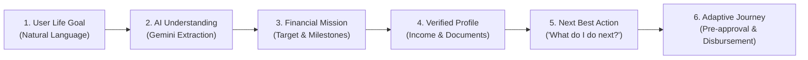

# FinPath AI — Complete Walkthrough & Presentation Guide

Welcome to the comprehensive walkthrough for **FinPath AI**, an AI-powered financial journey platform inspired by modern fintech design standards (Paytm blue aesthetic, clean whitespace, rounded cards, and strong visual hierarchy).

---

## 1. Product Philosophy & Core Differentiator

Traditional banking platforms are **product-catalog centric**: they present a wall of credit cards, personal loans, and mutual funds, forcing the user to decipher which product solves their life event.

**FinPath AI is goal-first**:



Every screen answers three fundamental questions for the customer:
1. **Where am I?** (Current stage in the financial journey)
2. **What is my current financial status?** (Readiness %, verified assets, missing requirements)
3. **What should I do next?** (The prominent *Next Best Action*)

---

## 2. Tour of the Refined Platform

### 2.1 Landing Page (`http://localhost:3000`)
* **Hero Headline**: *"Turn your financial goal into a clear journey."*
* **Interactive Conversational Goal Input**:
  * Try clicking one of the sample prompt chips (e.g., *"I want to study in Germany next year with ₹12 lakh"*).
  * Click **"Analyze with AI"** to see the 4-step real-time AI extraction simulation:
    - `✓ Goal detected (Education)`
    - `✓ Target amount detected (₹12,00,000)`
    - `✓ Timeline detected (1 Year)`
    - `✓ Financial mission ready`
  * Click **"Create Financial Mission"** to jump straight into the mission wizard with your parameters pre-populated.
* **4 Core Capabilities**: Highlights Goal Understanding, Financial Mission, Intelligent Document OCR, and Adaptive Journey.

---

### 2.2 Instant Demo Mode (`http://localhost:3000/demo`)
* **Zero-login demonstration** tailored for hackathon juries and stakeholders.
* **Pre-loaded with real-life data**:
  * **Mission**: Study in Germany
  * **Target**: ₹12,00,000 | **Timeline**: 1 Year | **Readiness**: 73%
  * **Next Best Action Card**: *"Verify your offer letter — TUM M.Sc CS tuition and dates need confirmation."*
  * **Interactive Document Cards**:
    - `Passport` — Confirmed ✓
    - `Bank Statement` — Confirmed ✓ (HDFC ₹3,45,000 balance)
    - `Offer Letter` — Review Required ⚠️ (Click **"Review Document"** to trigger the AI verification modal, then click **"Confirm Information"** to watch the readiness score jump to **86%**!)
    - `Salary Slip` — Pending

---

### 2.3 Main Dashboard (`http://localhost:3000/dashboard`)
* **Personalized Header**: `Good morning, [User]` with real-time status summary.
* **Prominent Next Best Action Banner**: Dynamic recommendation engine that guides users based on real database state:
  * Prompts document verification if unreviewed files exist.
  * Prompts profile completion if financial profile is under 80%.
  * Prompts missing bank statements if fewer than 3 documents are uploaded.
* **Financial Mission Hero Card**:
  * Displays ₹12,00,000 target, 1-year timeline, and dynamic readiness gauge.
* **5-Stage Progress Breakdown**:
  * Goal Definition: `Confirmed ✓`
  * Financial Profile: `Verified ✓ (82%)`
  * Documents: `4/5 Verified`
  * Readiness Assessment: `70% In Progress`
  * Financial Options: `Pending`

---

### 2.4 Document Center (`http://localhost:3000/documents`)
* **Drag-and-Drop Uploader**: Accepts PDF, JPG, PNG up to 10MB with SHA-256 deduplication.
* **FinPath Trusted Data Architecture Banner**:
  `1. AI Extracted → 2. User Verifies → 3. Data Becomes Trusted`
* **4 Standard Mission Requirements**:
  * Passport / National ID
  * Bank Statement (Last 6 Months)
  * Offer Letter / Admission
  * Salary Slip / Co-Borrower Income Proof
* **Interactive AI Verification Modal**:
  * Inspect extracted data (University, Program, Tuition €12,000, Confidence 94%).
  * Confirm values to lock them as trusted database records.
* **Direct Deep-Dive Link**: View and edit specific raw OCR fields at `/documents/[id]`.

---

### 2.5 Missions & Journey Stages (`http://localhost:3000/missions`)
* Displays active and archived financial missions.
* **The 7 Journey Stages Roadmap**:
  ```
  1. Goal Definition (✓ Completed)
  ↓
  2. Financial Profile (✓ Completed)
  ↓
  3. Document Verification (📍 Active Stage)
  ↓
  4. Readiness Assessment (In Calculation)
  ↓
  5. Financial Options (Upcoming)
  ↓
  6. Application & Pre-Approval (Upcoming)
  ↓
  7. Disbursement & Completion (Upcoming)
  ```
* **Interactive Inspection**: Click any stage pill to see its specific requirements and milestones.

---

### 2.6 Financial Profile Dashboard (`http://localhost:3000/profile`)
* **Fintech Metric Cards**:
  * Monthly Income: `₹75,000`
  * Monthly Expenses: `₹38,000` (50% expense ratio)
  * Liquid Savings: `₹4,20,000` (Verified via HDFC statement)
  * Existing EMIs: `₹12,000` (16% DTI, low risk)
  * Employment: `SALARIED` (3+ years experience)
* **Profile Completeness Bar (82%)**:
  * Dynamic recommendation callout: *"Add monthly investment & provident fund details to reach 100%"*.
* **Inline Edit Form**: Toggle *"Edit Profile"* to update any figures with instant recalculation.

---

### 2.7 AI Journey Assistant (`http://localhost:3000/ai`)
* **Conversational Financial Copilot**:
  * Connected to `POST /api/ai/chat` with active mission context awareness.
* **Pre-Built Prompt Chips**:
  * *"What should I do next?"*
  * *"What documents am I still missing?"*
  * *"Why is my salary slip required?"*
  * *"How complete is my financial profile?"*
  * *"Explain my Germany education mission"*
* **Actionable Replies**: Responses include one-click action buttons (e.g., *"⚡ Review Salary Slip"*).

---

### 2.8 Progress Dashboard (`http://localhost:3000/progress`)
* **73% Readiness Header Banner**: High-impact visual score card.
* **Completed vs. Pending Actions Matrix**: Side-by-side comparison of verified achievements vs. current bottlenecks.
* **Chronological Milestone Timeline**: Step-by-step audit trail showing dates, verification badges, and next steps.

---

### 2.9 Global Navigation & Smart Notifications
* **Top Navigation Bar**: Sticky header with clean logo, route indicators, and user avatar.
* **Notification Bell**:
  * Shows unread badge count.
  * Dropdown lists contextual alerts:
    - *"Document Verification Required — Your salary slip was parsed."*
    - *"Profile 82% Complete — Add investments to reach 100%."*
    - *"Mission Milestone Ready — Funding options calculating."*
  * Supports *"Mark all read"* and direct navigation on click.
* **Mobile Bottom Bar**: Appears automatically on screens `<= 768px` (`Home | Missions | Documents | AI | Profile`).

---

## 3. Recommended 3-Minute Live Demo Script

Follow this sequence when presenting to a jury or stakeholder:

1. **Start on Landing Page (`/`)**:
   - Point out the headline and click the prompt chip: *"I want to study in Germany next year with ₹12 lakh"*.
   - Click **"Analyze with AI"** to demonstrate real-time natural language extraction.
2. **Jump to Demo Mode (`/demo`)**:
   - Explain: *"This is a pre-loaded real-life journey for a student heading to Germany."*
   - Highlight the **Next Best Action Card**: *"The system immediately answers 'What should I do next?'"*.
   - Click **"Review Document"** on the Offer Letter card → show the AI extraction modal (TUM, €12,00,000 tuition, 94% confidence) → click **"Confirm Information"** → observe the readiness score increase to **86%**.
3. **Showcase AI Assistant (`/ai`)**:
   - Click the prompt chip: *"What documents am I still missing?"*.
   - Show how the AI assistant responds with the user's real missing documents and suggests the next action.
4. **Showcase Missions Roadmap (`/missions`)**:
   - Walk through the **7 Journey Stages** from Goal → Profile → Documents → Assessment → Options → Application → Completion.
5. **Conclude on Financial Profile (`/profile`)**:
   - Show the 82% completeness score, verified liquid assets, and DTI ratio.

---

## 4. Verification & Health Summary

* **Backend Health**: `GET http://localhost:8000/health` → `{"status": "healthy"}`
* **Automated Tests**: `python -m pytest tests/` → **18/18 passing (100%)**
* **Frontend Build**: `npm run build` → **14/14 static pages generated with 0 errors**
* **Git Repository**: Synced and pushed to [`https://github.com/Sushrut-Kale/paytm.git`](https://github.com/Sushrut-Kale/paytm.git) (`main` branch)
