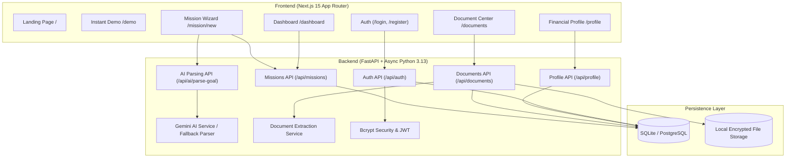

# FinPath AI — Phase 1 Walkthrough & User Guide

Welcome to the **FinPath AI** Phase 1 documentation. This guide walks you through the platform concept, system architecture, core user journeys, API specifications, and local verification steps.

---

## 1. Product Overview

> **"FinPath is a goal-first financial journey platform. Instead of asking the customer which financial product they want, FinPath first understands what the customer is trying to achieve and creates a Financial Mission around that goal."**

### Traditional Banking vs. FinPath AI
| Dimension | Traditional Approach | FinPath AI Approach |
| :--- | :--- | :--- |
| **Starting Point** | Catalog of loans, credit cards, mutual funds | Customer's real-life goal & destination |
| **User Input** | Rigid multi-page loan applications | Natural conversational prompt (text or voice) |
| **Journey Model** | Transactional & fragmented | Unified **Financial Mission** with milestone tracking |
| **Document Processing**| Manual paperwork verification | Intelligent document OCR & auto-extraction |
| **Profile Building** | Static credit scores & isolated KYC | Living Financial Profile calculated across missions |

---

## 2. System Architecture



---

## 3. Core Feature Walkthrough

### 3.1 Landing Page (`/`)
* **Dynamic Typewriter Hero**: Cycles through real-world financial goals:
  * *"I want to study in Germany next year with ₹12 lakh"*
  * *"I want to buy my first home in 3 years with ₹50 lakh"*
  * *"I want to build an emergency fund of ₹3 lakh in 6 months"*
* **Instant Value Proposition**: Highlights the 4 pillars: Natural Goal Input, Financial Missions, Smart Readiness, and Intelligent Extraction.
* **Instant Demo Button**: Direct 1-click access to pre-populated demo data without registering.

### 3.2 Instant Demo Mode (`/demo`)
* Pre-loaded with a completed mission:
  * **Goal**: Study in Germany (Education)
  * **Target Amount**: ₹12,00,000
  * **Timeline**: 1 year
  * **Readiness Score**: 73% Complete
  * **Documents**: Passport (Confirmed), Bank Statement (Confirmed), Offer Letter (Extracted), Salary Slip (Pending)
* Enables instant stakeholder demonstrations without signing up.

### 3.3 Goal Understanding & Mission Creation (`/mission/new`)
1. **Conversational Input**: User inputs a natural goal sentence.
2. **AI Extraction**: Uses Google Gemini AI (with a built-in regex fallback) to extract:
   * `goal_category` (e.g., `education`, `home_purchase`, `travel`, `emergency_fund`)
   * `target_amount` & `currency` (e.g., `1200000`, `INR`)
   * `destination` (e.g., `Germany`)
   * `timeline_text` / `deadline` (e.g., `1 year`)
3. **Clarification Handling**: If key parameters are missing, the system prompts targeted clarification questions.
4. **Structured Confirmation Card**: User can inspect and adjust parsed numbers before creating the mission.

### 3.4 Financial Mission Dashboard (`/dashboard`)
* **Mission Header**: Displays active mission status, target amount, currency, and timeline.
* **Milestone Progress Bar**: Combines document completion, profile completion, and goal definition into an aggregate journey readiness score.
* **Mission Requirements Checklist**: Clear actionable tasks to progress the mission.

### 3.5 Document Verification Center (`/documents`)
* **Drag-and-Drop Uploader**: Accepts PDF, JPEG, and PNG files up to 10MB.
* **Duplicate Detection**: Computes SHA-256 file hashes to prevent accidental re-uploads.
* **Document Preview & Extraction Review**:
  * Shows extracted fields (e.g., Document Number, Holder Name, Expiry Date, Bank Name, Account Number).
  * In-line editing interface allowing users to review and confirm OCR data before persisting.

### 3.6 Financial Profile Management (`/profile`)
* Captures user financial snapshot: Monthly Income, Monthly Expenses, Existing EMIs, Savings, and Employment Status.
* **Real-time Completion Indicator**: Visual progress bar tracking profile data density.

---

## 4. API Endpoints Reference

Base URL: `http://localhost:8000`  
Interactive Swagger Docs: [http://localhost:8000/docs](http://localhost:8000/docs)

| Group | Method | Endpoint | Description |
| :--- | :--- | :--- | :--- |
| **Auth** | `POST` | `/api/auth/register` | Register a new user and receive JWT bearer token |
| **Auth** | `POST` | `/api/auth/login` | Log in with email & password |
| **Auth** | `GET` | `/api/auth/me` | Fetch currently authenticated user |
| **AI** | `POST` | `/api/ai/parse-goal` | Parse natural language goal into structured entity |
| **Missions** | `POST` | `/api/missions/` | Create a confirmed Financial Mission |
| **Missions** | `GET` | `/api/missions/` | List all missions belonging to the active user |
| **Missions** | `GET` | `/api/missions/{id}` | Retrieve mission details |
| **Missions** | `PATCH`| `/api/missions/{id}` | Update mission title, status, or parameters |
| **Documents**| `POST` | `/api/documents/upload` | Upload document file (multipart/form-data) |
| **Documents**| `GET` | `/api/documents/` | List user documents |
| **Documents**| `GET` | `/api/documents/{id}/extraction` | Get OCR extraction fields |
| **Documents**| `POST` | `/api/documents/{id}/confirm` | Confirm extracted values |
| **Profile** | `GET` | `/api/profile/` | Fetch user financial profile |
| **Profile** | `PATCH`| `/api/profile/` | Update income, expenses, and savings |
| **System** | `GET` | `/health` | Healthcheck returning `{ "status": "healthy" }` |

---

## 5. Verification & Testing

### Running Automated Tests
Run the complete backend test suite from `backend/`:
```powershell
python -m pytest tests/ -v
```

### Test Coverage Results (18/18 Passing)
* `test_register_user` — User creation and JWT token issuance.
* `test_register_duplicate_email` — HTTP 400 rejection on duplicate email.
* `test_login` — Credential validation and token receipt.
* `test_login_wrong_password` — HTTP 401 unauthorized rejection.
* `test_parse_goal_germany_study` — Accurate extraction of Germany Education ₹12L goal.
* `test_parse_goal_missing_info` — Clarification questions trigger when amount is omitted.
* `test_create_mission` — Creation and persistence of Financial Mission.
* `test_mission_persists` — Verification of database integrity across queries.
* `test_mission_authorization` — Cross-tenant isolation (User B cannot access User A's mission).
* `test_list_missions_isolation` — Listing only shows authenticated user's records.
* `test_upload_invalid_format` — Rejection of unsupported file extensions (.exe, .txt).
* `test_upload_valid_document` — Storage and extraction of PDF/image uploads.
* `test_upload_duplicate_rejected` — SHA-256 hash collision rejection.
* `test_document_authorization` — Documents strictly isolated by user ID.
* `test_empty_profile` — Default profile initialization.
* `test_update_profile` — Saving income, expenses, and employment status.
* `test_profile_completion_calculation` — Percentage calculation accuracy.

---

## 6. How to Run Locally

### Prerequisites
* Python 3.11+ (Python 3.13 supported)
* Node.js 18+ & npm
* Git

### Starting the Backend
```powershell
cd s:\paytm\backend
$env:DATABASE_URL="sqlite+aiosqlite:///./finpath_dev.db"
$env:SECRET_KEY="dev-secret-finpath-2026"
python -m uvicorn app.main:app --port 8000 --reload
```

### Starting the Frontend
```powershell
cd s:\paytm\frontend
npm run dev
```

### Accessing the Web Application
* **Frontend**: [http://localhost:3000](http://localhost:3000)
* **Backend API Docs**: [http://localhost:8000/docs](http://localhost:8000/docs)
