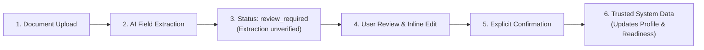

# FinPath AI — Comprehensive Product Documentation

## 1. Product Overview

**FinPath AI** is an intelligent, goal-first financial journey platform designed to guide individuals through complex life milestones. Rather than beginning with a fragmented catalog of financial products (such as unsecured personal loans, credit cards, or mutual funds), FinPath starts with the user's real-life objective — for example, pursuing graduate studies abroad, acquiring a home, or launching a venture.

FinPath converts unstructured natural-language ambitions into structured **Financial Missions**, evaluates verifiable financial readiness through deterministic metrics, streamlines document ingestion with AI-assisted OCR, and continuously surfaces the single **Next Best Action (NBA)** required to make progress toward that milestone.

---

## 2. Problem Statement

Modern consumer finance platforms suffer from four structural deficiencies:

1. **Product-First Friction**: Platforms force users to self-diagnose financial instruments (e.g., asking "Do you want an education loan or a line of credit?") before understanding the underlying goal or budget parameters.
2. **Document Opacity**: Users are intimidated by unstructured paperwork (bank statements, tax declarations, offer letters) without knowing which fields matter, why they are required, or whether they meet underwriting criteria.
3. **Absence of Actionable Clarity**: Users lack answers to three essential questions at any point in their journey:
   - *Where am I in the process?*
   - *What is my true financial readiness?*
   - *What is the exact next step I must complete?*
4. **Black-Box AI Distrust**: Generic conversational agents often hallucinate financial parameters or fail to establish deterministic verification, creating compliance and trust liabilities.

FinPath AI directly resolves these challenges by introducing a goal-first UX, a deterministic readiness engine, user-confirmed document extraction, and continuous milestone tracking.

---

## 3. Target Users & Personas

### Persona A: The Global Education Aspirant
- **Profile**: Final-year undergraduate or young professional (Age 21–28).
- **Life Event**: Seeking post-graduate admission abroad (e.g., TUM Germany, US, UK).
- **Pain Point**: Needs ₹12–25 lakh; confused about blocked accounts, tuition schedules, collateral requirements, and document timelines.
- **FinPath Value**: Converts "Study in Germany next year" into a structured mission, identifies missing offer letters or bank statements, and calculates true tuition coverage.

### Persona B: The First-Time Homebuyer
- **Profile**: Salaried professional or dual-income household (Age 28–42).
- **Life Event**: Planning residential property purchase within 18–24 months.
- **Pain Point**: Struggles with debt-to-income (DTI) calculations, down-payment readiness, and co-borrower documentation.
- **FinPath Value**: Continuously monitors DTI, evaluates savings accumulation against target down payments, and provides pre-approval readiness.

### Persona C: The Career Entrepreneur / Micro-Business Founder
- **Profile**: Freelancer, consultant, or small business founder.
- **Life Event**: Capital expansion or cash-buffer establishment.
- **Pain Point**: Irregular income streams, complex bank statements, uncertain underwriting eligibility.
- **FinPath Value**: Ingests multi-month statements, structures verifiable cash flows, and establishes funding milestones.

---

## 4. Product Philosophy

FinPath AI is built upon five foundational tenets:

1. **Goal-First, Product-Last**: We never pitch financial products until the customer's goal, timeline, and financial profile are thoroughly understood and verified.
2. **Evidence-Aware & Deterministic**: Application state, eligibility, and next actions are computed by deterministic rule engines, not by non-deterministic generative models.
3. **User-Controlled Trust Architecture**: AI extracts; humans verify. Extracted data only becomes authoritative database records once explicitly confirmed by the user.
4. **Action-Oriented Simplicity**: Every screen prioritizes the immediate next action, reducing cognitive overload and administrative drop-off.
5. **Radical Transparency**: Users are shown the exact factors influencing their readiness score and why specific documents are requested.

---

## 5. Core Concepts

| Concept | Definition |
| :--- | :--- |
| **Financial Mission** | The core domain entity representing a structured life goal with financial constraints (target amount, timeline, category, stage). |
| **Financial Profile** | The user's verifiable economic baseline: gross income, fixed obligations, liquid savings, EMIs, and employment credentials. |
| **Readiness Engine** | A deterministic 5-component scoring algorithm producing a 0–100% feasibility score. |
| **Next Best Action (NBA)** | A 9-rule prioritized recommendation engine identifying the single most urgent task. |
| **Trusted Data Boundary** | The boundary separating raw AI extractions from user-confirmed database records. |
| **7-Stage Roadmap** | The progressive milestone pipeline from goal definition through disbursement. |

---

## 6. The Financial Mission Model

A Financial Mission anchors the entire user experience. Each mission tracks:
- **Category**: Education, Healthcare, Home Purchase, Vehicle, Business, Emergency, Travel, Investment, or Other.
- **Target Amount & Currency**: E.g., `₹12,00,000 INR`.
- **Destination & Context**: E.g., `Germany` or institution name.
- **Timeline**: Target completion text (`Next year`) and absolute ISO date deadlines.
- **Stage (1–7)**: Current lifecycle phase.
- **Associated Documents**: Mandatory document checklist mapped to the goal category.
- **Status**: `DRAFT`, `ACTIVE`, `PAUSED`, or `COMPLETED`.

---

## 7. Natural Language Goal Understanding

Users describe their aspiration in conversational language:
> *"I want to study in Germany next year and I need around ₹12 lakh."*

### Extraction Workflow
1. **AI Processing**: Google Gemini (or the built-in regex/heuristic fallback parser) analyzes intent, entities, numerical amounts, geographic destinations, and temporal markers.
2. **Structured Output**: Produces a standardized JSON contract:
   - `goal_category`: `"education"`
   - `goal_title`: `"Study in Germany"`
   - `target_amount`: `1200000`
   - `currency`: `"INR"`
   - `destination`: `"Germany"`
   - `timeline_text`: `"Next year"`
   - `confidence`: `0.92`
3. **User Review Modal**: The user inspects and validates the parsed parameters before the mission is written to the database.

---

## 8. Document Intelligence & OCR Pipeline

FinPath handles critical financial records with an asynchronous ingestion pipeline:

```
[Upload PDF/PNG/JPG]
        │
        ▼
[SHA-256 Deduplication] ──(Match Found)──► Return 409 Conflict
        │
        ▼ (New File)
[MIME & Size Validation] ──(Invalid)──────► Reject File
        │
        ▼
[AI Extraction & Field Scoring]
        │
        ▼
[Status: 'review_required']
```

### Supported Document Types
- **Passport & National ID**: Name, ID number, expiration, issuing authority.
- **Bank Statements (6 Months)**: Account holder, institution, closing balance, average monthly deposits.
- **Offer / Admission Letters**: Institution, degree program, start date, total tuition obligations.
- **Salary Slips (3 Months)**: Employer name, gross salary, net pay, deductions, pay period.

---

## 9. The Verification Model: "Data Becomes Trusted"

A core architectural safeguard is the **Trusted Data Boundary**:



- Unconfirmed extractions are never used in automated credit assessments or official applications.
- Users can inspect OCR confidence scores, correct extracted typos or numerical values, and press **"Confirm Information"**.
- Confirmation triggers audit logging, notification dispatch, and readiness recalculation.

---

## 10. Verifiable Financial Profile

The Financial Profile captures five quantitative pillars:
1. **Monthly Gross Income**: Baseline earning power.
2. **Monthly Living Expenses**: Operational burn rate.
3. **Liquid Savings**: Readily available cash reserves (verified via bank statements).
4. **Existing EMI Commitments**: Fixed debt servicing obligations.
5. **Employment Attributes**: Employment type (Salaried, Self-Employed, Student) and years of experience.

### Calculated Indicators
- **Expense Ratio**: `Expenses / Income` (target < 50%).
- **Debt-to-Income (DTI)**: `EMIs / Income` (target < 30%).
- **Profile Completeness**: A 0–100% metric reflecting data density. Missing fields trigger targeted prompts.

---

## 11. Progress Tracking & Milestone Visualizer

Progress is tracked along a progressive 7-stage maturity model:

| Stage | Title | Status Indicator | Requirements |
| :---: | :--- | :---: | :--- |
| **1** | **Goal Definition** | Complete / In Progress | Life goal categorized, amount and timeline established |
| **2** | **Financial Profile** | Complete / In Progress | Income, expenses, savings, and employment captured |
| **3** | **Document Verification** | Active | Category-required documents uploaded and confirmed |
| **4** | **Readiness Assessment** | In Calculation | Weighted score calculated, DTI within threshold |
| **5** | **Financial Options** | Roadmap / Upcoming | Pre-approved funding solutions matched to mission |
| **6** | **Application Preparation**| Roadmap / Upcoming | Unified application bundle prepared for partners |
| **7** | **Disbursement & Completion**| Roadmap / Upcoming | Goal funded and archived |

---

## 12. Next Best Action (NBA) Engine

The NBA Engine prevents user stagnation by running a deterministic priority queue over application state:

1. **Rule 1 (Critical)**: No active mission exists → *Create your first Financial Mission*.
2. **Rule 2 (High)**: Uploaded document in `review_required` state → *Verify extracted fields from document*.
3. **Rule 3 (High)**: Profile completeness < 40% → *Complete your baseline financial details*.
4. **Rule 4 (Medium)**: Mandatory document category missing → *Upload missing document (e.g. Bank Statement)*.
5. **Rule 5 (Medium)**: Profile completeness 40%–70% → *Add investment or savings details to boost score*.
6. **Rule 6 (Medium)**: Unconfirmed extractions exist → *Confirm pending document data*.
7. **Rule 7 (Low)**: Readiness score < 80% with component deficits → *Address weakest score component*.
8. **Rule 8 (Low)**: Goal deadline approaching within 30 days → *Review mission timeline and contingency*.
9. **Rule 9 (Low)**: Readiness score ≥ 80% → *Advance to next journey stage*.

---

## 13. Context-Aware AI Assistant

The AI Copilot (`POST /api/ai/chat`) provides explainable guidance:
- **Context Injection**: Automatically provided with the active mission's title, category, readiness score, profile completeness, and unverified documents.
- **Actionable Responses**: Emits actionable markdown chips (e.g., `[Verify Offer Letter]`) alongside answers.
- **Guardrails**: Explains verified financial data; explicitly refuses to provide unlicensed financial advice or speculate on missing records.
- **Heuristic Fallback**: Generates structured, deterministic advice even when external LLM APIs are unreachable.

---

## 14. Demo Environment

An interactive, zero-login showcase mode accessible at `/demo`:
- Pre-populated with an authentic scenario: **Study in Germany (₹12,00,000, 1 Year)**.
- Features pre-loaded documents: Passport (`Confirmed`), Bank Statement (`Confirmed`), and Offer Letter (`Review Required`).
- Interactive review flow: Allows users to click **"Review Document"** on the TUM Offer Letter, inspect OCR fields (€12,000 tuition, 94% confidence), and click **"Confirm Information"** to watch the readiness score jump in real time from **73% to 86%**.
- Includes a subtle *"Demo Environment"* watermark with a one-click session reset.

---

## 15. User Journey Walkthrough

```
[Landing Page] ──► [Conversational Goal Input] ──► [AI Entity Extraction]
                                                           │
                                                           ▼
[Dashboard / Missions] ◄── [User Validates & Creates] ◄────┘
        │
        ├──► [Financial Profile Setup] ──► Completeness Updated
        │
        ├──► [Document Upload] ──► OCR Extraction ──► Human Confirmation
        │
        └──► [NBA Guided Progression] ──► Readiness Calculated ──► Goal Funded
```

---

## 16. Technical System Architecture

```
┌─────────────────────────────────────────────────────────────┐
│                 Next.js Frontend (App Router)               │
│  UI: Vanilla CSS Design System, Responsive AppNav, Views    │
│  State: Zustand (Auth) + React Hooks (Local/Form State)     │
└──────────────────────────────┬──────────────────────────────┘
                               │ HTTPS / JSON REST
┌──────────────────────────────▼──────────────────────────────┐
│                    FastAPI Backend Server                   │
│  Auth (JWT/bcrypt) | REST Endpoints | Route Dependency DI   │
├──────────────────────────────┬──────────────────────────────┤
│       Service Layer          │       AI & OCR Engines       │
│  • ReadinessEngine           │  • GoalUnderstandingService  │
│  • NBAEngine                 │  • Gemini 1.5 Flash Provider │
│  • JourneyEngine             │  • Heuristic Rule Fallbacks  │
├──────────────────────────────┴──────────────────────────────┤
│                     Repository Layer                        │
│  MissionRepo | DocRepo | ProfileRepo | NotifRepo | AuditRepo│
└──────────────────────────────┬──────────────────────────────┘
                               │ Async ORM
┌──────────────────────────────▼──────────────────────────────┐
│                    Database & Storage                       │
│  • SQLite (Dev) / PostgreSQL (Prod) via SQLAlchemy Async   │
│  • File Storage: Local Secure Hash-Based Filesystem         │
└─────────────────────────────────────────────────────────────┘
```

---

## 17. Data Flow & Security Boundaries

1. **User Isolation**: Every database query is scoped strictly by `user_id` extracted from the cryptographically verified JWT bearer token.
2. **Audit Trails**: All state mutations (document creation, deletion, confirmation, mission updates) emit permanent records into `audit_logs`.
3. **Payload Sanitization**: Pydantic v2 schemas enforce type validation, boundary constraints, and injection protection on all request bodies.
4. **Local File Integrity**: Uploaded binaries are hashed using SHA-256; deduplication prevents redundant storage, while strict MIME and size caps safeguard server storage.

---

## 18. Artificial Intelligence Architecture & Constraints

- **LLM as Advisor, Not Authority**: Generative AI never sets database states directly. AI extracts parameters into a staging schema; human confirmation persists authoritative data.
- **Deterministic Critical Path**: Readiness scoring and NBA calculations are 100% deterministic code paths that function identically with or without AI API connectivity.
- **Fail-Safe Graceful Degradation**: If `LLM_API_KEY` is not provided or Gemini returns an error, regex entity extractors and rule-based heuristic engines seamlessly take over.

---

## 19. Current Implementation Status (Phase 1 Complete)

| Component | Implementation State | Verification |
| :--- | :--- | :--- |
| **Authentication** | Complete (JWT, bcrypt, user isolation) | Unit & integration tested |
| **Goal Parsing** | Complete (Gemini + regex heuristic fallback) | Tested via pytest & live API |
| **Mission Management** | Complete (Full CRUD, stages 1–7 tracked) | Tested & validated |
| **Document Processing** | Complete (Upload, SHA-256 hash, OCR review, confirmation) | Tested & validated |
| **Readiness Engine** | Complete (5-factor deterministic calculator) | 100% unit test coverage |
| **Next Best Action** | Complete (9-rule deterministic engine) | Unit tested & verified |
| **Notifications** | Complete (CRUD, unread counter, nav bell) | Verified across endpoints |
| **Demo Mode** | Complete (Interactive zero-auth scenario) | End-to-end verified |

---

## 20. Known Limitations

1. **OCR Ingestion**: Current document extraction uses structured heuristic simulation and Gemini Vision when configured; production deployment will incorporate specialized OCR pipelines (e.g. AWS Textract or Tesseract).
2. **PostgreSQL Migration**: The system is fully architected for async PostgreSQL, but uses SQLite in default local development mode.
3. **Journey Stages 5–7**: Stages 1 through 4 are fully functional; Stages 5 through 7 (lender matching, automated loan disbursement) are currently represented as interactive roadmap milestones awaiting commercial partner API integrations.

---

## 21. Product Roadmap

### Completed (Phase 1)
- [x] Natural language goal parsing and entity extraction.
- [x] Financial mission creation and lifecycle management.
- [x] Document upload with deduplication and trusted verification flow.
- [x] Verifiable financial profile with DTI and completeness metrics.
- [x] Deterministic 5-factor readiness engine and 9-rule NBA queue.
- [x] Contextual journey assistant with heuristic fallback.
- [x] Global notification system and zero-auth demo environment.
- [x] Unified fintech visual design system.

### Next (Phase 2)
- [ ] Direct bank account aggregation via Account Aggregator (AA) framework.
- [ ] Real-time credit bureau (CIBIL / Experian) pull integration.
- [ ] Multi-currency conversion and international fee index for foreign study missions.
- [ ] Co-borrower and guarantor invitation workflows.

### Future (Phase 3 & 4)
- [ ] Real-time lending partner pre-approvals via open banking APIs.
- [ ] Escrow-based milestone fund disbursement.
- [ ] Predictive budget rebalancing based on actual spending telemetry.
