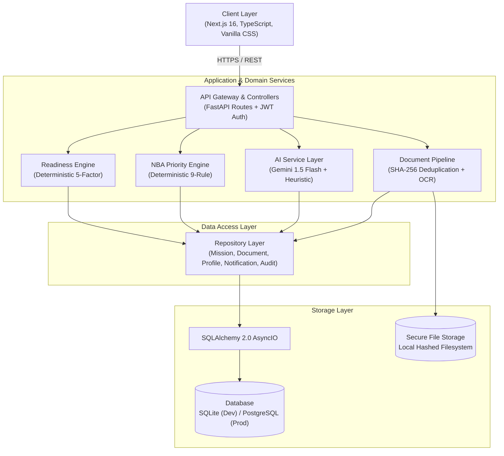
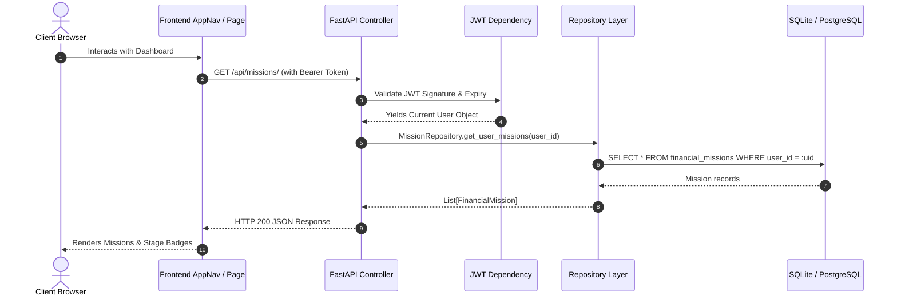
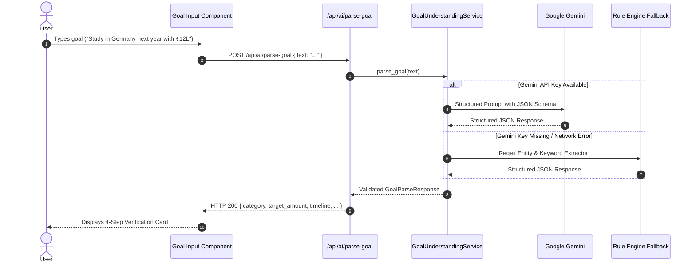
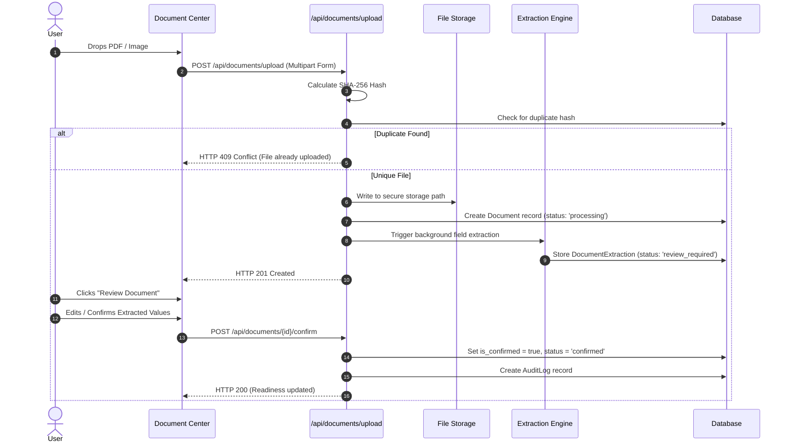
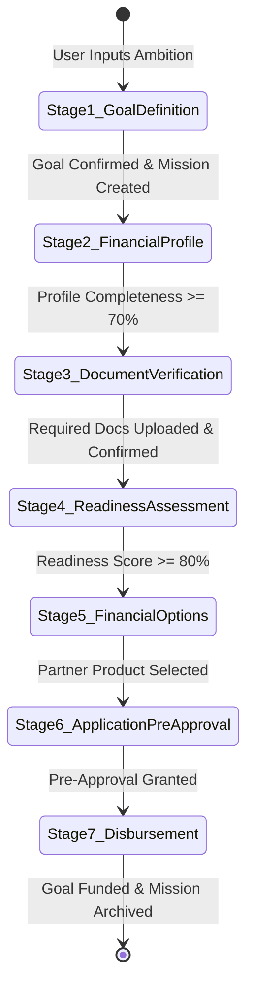

# FinPath AI — System Architecture Specification

## 1. Architectural Overview

**FinPath AI** follows a decoupled, layered micro-monolith architecture characterized by strict separation of concerns, deterministic business decision engines, asynchronous data ingestion, and human-in-the-loop AI boundaries.

---

## 2. Layered Component Responsibilities

### 2.1 Presentation Layer (Frontend)
- **Framework**: Next.js 16 (App Router) with Turbopack.
- **Styling Architecture**: FinPath Design System using native CSS custom properties (`globals.css`), eliminating heavy external CSS runtime overhead.
- **State Management**:
  - `store/auth.ts`: Zustand store managing user profile state and JWT session token persistence.
  - Component State: Native React hooks (`useState`, `useCallback`, `useEffect`) for localized forms and extraction reviews.
- **HTTP Client**: Axios with request/response interceptors injecting `Authorization: Bearer <token>` and handling 401 token expiry.

### 2.2 API Layer (FastAPI Backend)
- **FastAPI Core**: Async route controllers utilizing dependency injection (`Depends(get_db)`, `Depends(get_current_user)`).
- **Contract Enforcement**: Pydantic v2 schemas providing strict schema parsing, serialization, and input validation.
- **CORS Middleware**: Explicitly bound to configured origins (`FRONTEND_URL`).

### 2.3 Domain Services Layer
- **ReadinessEngine** (`app/services/missions/readiness.py`):
  - Pure, deterministic calculation taking mission parameters, verified documents, and profile statistics.
  - Produces an auditable 0–100% score broken into 5 weighted pillars.
  - **Zero LLM dependency**.
- **NBAEngine** (`app/services/missions/nba.py`):
  - 9-rule sequential priority queue evaluating application state to output a single, unambiguous Next Best Action.
  - **Zero LLM dependency**.
- **GoalUnderstandingService** (`app/services/ai/goal_understanding.py`):
  - Bridges Google Gemini with a zero-dependency heuristic fallback engine using regex entity extractors.

### 2.4 Data Access Layer (Repository Pattern)
All database interactions are encapsulated in typed repositories:
- `MissionRepository`: Handles CRUD for `FinancialMission`, category filtering, and stage progression.
- `DocumentRepository`: Handles `Document` and `DocumentExtraction` persistence and confirmation states.
- `ProfileRepository`: Handles `FinancialProfile` attributes, completeness metrics, and DTI indicators.
- `NotificationRepository`: Manages user notifications, unread queries, and batch status updates.
- `AuditRepository`: Logs immutable records of all state mutations.

---

## 3. End-to-End Request & Data Flows

### 3.1 Standard Authenticated API Request Flow

---

### 3.2 AI Goal Understanding Request Flow (with Fallback)

---

### 3.3 Document Ingestion & Verification Flow

---

## 4. Mission Lifecycle State Machine

---

## 5. Security & Isolation Model

1. **Authentication**: JSON Web Tokens (JWT) signed with HMAC-SHA256 (`HS256`) using a server-side secret key (`SECRET_KEY`). Expirations default to 7 days.
2. **Access Control**: Every database query filters by `user_id == current_user.id`. No user can view, edit, or delete another user's missions, documents, or profile data.
3. **Payload Sanitization**: Pydantic v2 schemas reject malformed attributes and prevent prototype injection attacks.
4. **File Safety**:
   - MIME validation restricting uploads to `application/pdf`, `image/png`, `image/jpeg`.
   - File size ceiling capped at 10 MB.
   - SHA-256 content hashing for integrity and collision deduplication.
5. **Audit Trails**: Critical life-cycle transitions write immutable entries to `audit_logs` tracking timestamp, acting user, resource type, and before/after metadata.

---

## 6. Resilience & Graceful Degradation

| Failure Mode | Detection | System Behavior |
| :--- | :--- | :--- |
| **Gemini API Down / Offline** | HTTP 5xx or API key missing | Automatically switches to deterministic regex heuristic fallback engine; 0 downtime. |
| **Corrupted Document File** | File parser exception | Marks document `status = 'failed'`; provides clean user-facing error message with re-upload prompt. |
| **Expired JWT Token** | HTTP 401 Unauthorized | Interceptor clears client credentials and cleanly redirects user to `/login` with saved return path. |
| **Duplicate Document** | SHA-256 collision in DB | Returns HTTP 409 Conflict with friendly message instead of overwriting existing data. |
