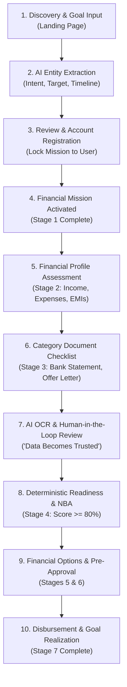

# FinPath AI — Complete User Journey Specifications

This document outlines the end-to-end user journeys supported by **FinPath AI**, covering standard successful flows, interactive demo experiences, edge-case recovery, and empty states.

---

## 1. Primary User Journey (End-to-End)

### Stage 1: Discovery & Goal Input
- **Action**: User visits `/` and types their life ambition in natural language into the hero prompt:
  > *"I want to study in Germany next year and I need around ₹12 lakh."*
- **Processing**: The user clicks **"Analyze with AI"**.
  - If `LLM_API_KEY` is present, Gemini extracts intent, target amount (`1200000`), currency (`INR`), destination (`Germany`), and timeline (`Next year`).
  - If offline or keyless, the heuristic fallback rules parser deterministically extracts identical structured fields.
- **Review**: The system displays a live 4-step parameter breakdown. The user reviews and clicks **"Create Financial Mission"**.

### Stage 2: Registration & Mission Inception
- **Action**: If unauthenticated, the user is seamlessly routed through `/register` or `/login`.
- **Outcome**: A JWT session is established and stored in the secure Zustand auth store. A new record is created in `financial_missions` associated with the user's ID, initialized to `stage = 1` and `status = 'ACTIVE'`.

### Stage 3: Financial Profile Completion
- **Action**: The user navigates to `/profile` (or is guided by the Next Best Action banner on `/dashboard`).
- **Data Captured**:
  - Monthly Gross Income (e.g., `₹75,000`)
  - Monthly Expenses (e.g., `₹38,000`)
  - Liquid Savings (e.g., `₹4,20,000`)
  - Existing EMIs (e.g., `₹12,000`)
  - Employment Status (`SALARIED`, 3+ years experience)
- **Impact**: The profile completeness metric rises to 82–100%. The readiness engine updates the profile weight (25% contribution).

### Stage 4: Document Upload & OCR Ingestion
- **Action**: User navigates to `/documents` and is presented with the Education Category checklist:
  - 📄 Passport / National ID
  - 🏦 Bank Statement (Last 6 Months)
  - 🎓 Offer Letter / University Admission
  - 💼 Salary Slip / Co-Borrower Proof
- **Security & Integrity**: Uploaded files undergo SHA-256 cryptographic hashing to prevent duplicate submissions.
- **Status Progression**: `uploaded` ➔ `processing` ➔ `extracted` ➔ `review_required`.

### Stage 5: Human-in-the-Loop Document Verification
- **Principle**: *AI extracts; humans confirm. Unconfirmed data never enters credit underwriting.*
- **Action**: The user opens the document review modal on `/documents` or deep-dives into `/documents/[id]`.
- **Review**:
  - Extracted fields: University (`Technical University of Munich`), Degree (`M.Sc CS`), Tuition (`€12,000`), Confidence (`94%`).
  - The user can edit any misread characters directly in the form.
  - The user clicks **"Confirm Information"**.
- **Outcome**: Status transitions to `confirmed`. Extracted values are promoted to trusted platform data.

### Stage 6: Deterministic Readiness & Next Best Action
- **Action**: User opens `/dashboard` or `/progress`.
- **Readiness Calculation**: The deterministic 5-factor engine calculates:
  - Goal completeness (15%) + Profile (25%) + Verified Documents (30%) + Financial ratios (20%) + Timeline (10%) = **82% Overall Readiness**.
- **Next Best Action (NBA)**: The 9-rule priority engine inspects system state and presents a single, high-contrast banner:
  > *"Next Best Action: Advance to Financial Options — Your readiness score qualifies for pre-approved partner matching."*

### Stage 7: Mission Realization & Milestone Archive
- Stages 5 through 7 represent loan selection, partner pre-approval, and final disbursement. Once funds are confirmed, the mission transitions to `status = 'COMPLETED'` and is moved to the user's historical archive.

---

## 2. Interactive Demo Journey (`/demo`)

Designed specifically for hackathon juries, evaluators, and stakeholders who wish to experience FinPath AI without creating an account:

1. **Access**: Navigate directly to `http://localhost:3000/demo`.
2. **Pre-Populated Environment**:
   - Persona: Arjun Sharma, aspiring student.
   - Mission: Study in Germany (Target: ₹12,00,000 | Timeline: 1 Year).
   - Baseline Readiness: **73%**.
3. **Interactive Verification Flow**:
   - The user locates the **Offer Letter** card marked `Review Required ⚠️`.
   - Clicks **"Review Document"** to trigger the AI inspection modal.
   - Inspects the OCR extraction (TUM, €12,000 tuition, 94% confidence).
   - Clicks **"Confirm Information"**.
4. **Instant Visual Feedback**:
   - Document badge changes to `Confirmed ✓`.
   - The readiness gauge animates upwards from **73% to 86%** in real time.
   - The Next Best Action dynamically updates from *"Verify your offer letter"* to *"Advance to Financial Options"*.
5. **Reset**: An option in the header allows one-click resetting of the demo state.

---

## 3. Empty-State Journey (First-Time User)

When a new user signs up without an existing mission:

1. **Dashboard Empty State**:
   - The NBA banner displays: *"Create your first Financial Mission to get started."*
   - A friendly illustration and a prominent primary action button: `[+ Start Financial Mission]`.
   - Document Center shows: *"No documents uploaded yet — select a mission to view required documents."*
   - Profile tab displays a 0% progress bar with helpful field guidance.
2. **Guiding Inception Flow**:
   - Clicking `[+ Start Financial Mission]` opens the conversational goal parser modal, guiding the user through intent extraction step-by-step.

---

## 4. Error Recovery & Exception Journeys

### Scenario A: Duplicate Document Upload
- **Trigger**: User uploads a bank statement identical in binary content to a file previously uploaded.
- **Handling**: Client-side / server-side SHA-256 hash matching catches the duplicate immediately.
- **User Message**: `"This document has already been uploaded for this mission. Please upload a fresh statement if you have an updated statement."` (HTTP 409 Conflict handled gracefully without crash).

### Scenario B: AI API Key Absent or LLM Service Timeout
- **Trigger**: External Gemini API key is missing or Google servers return 503.
- **Handling**: FinPath's `GoalUnderstandingService` automatically intercepts the exception and delegates parsing to the **Deterministic Heuristic Fallback Engine**.
- **User Message**: Parsing completes seamlessly without user disruption; health check reports `ai_mode: fallback`.

### Scenario C: Unconfirmed Document Ambiguity
- **Trigger**: AI extracts ambiguous values with confidence < 70%.
- **Handling**: The document is flagged with a high-visibility badge: `Low Confidence — Please Verify Carefully`. All extracted fields are presented as editable text boxes. The user edits the numbers manually and confirms.

### Scenario D: Session Expiry (JWT Expiration)
- **Trigger**: User returns after token expiration.
- **Handling**: Axios HTTP interceptor catches HTTP 401 Unauthorized, clears expired Zustand credentials, saves the current return URL, and redirects to `/login` with an informative banner: `"Your session has expired. Please sign in to continue."`
